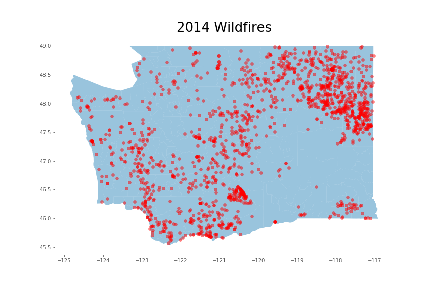
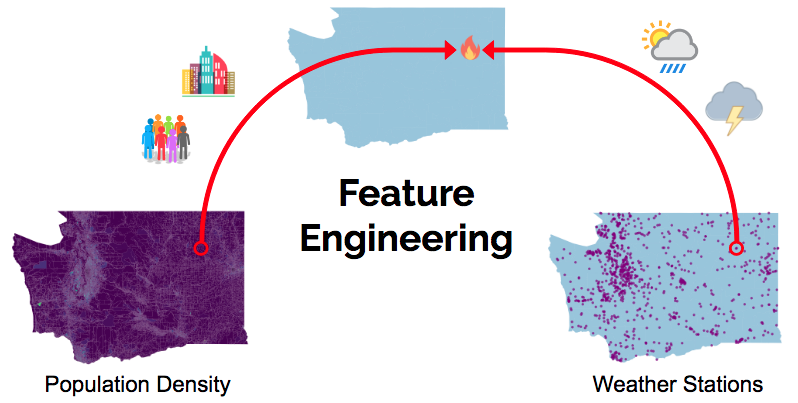
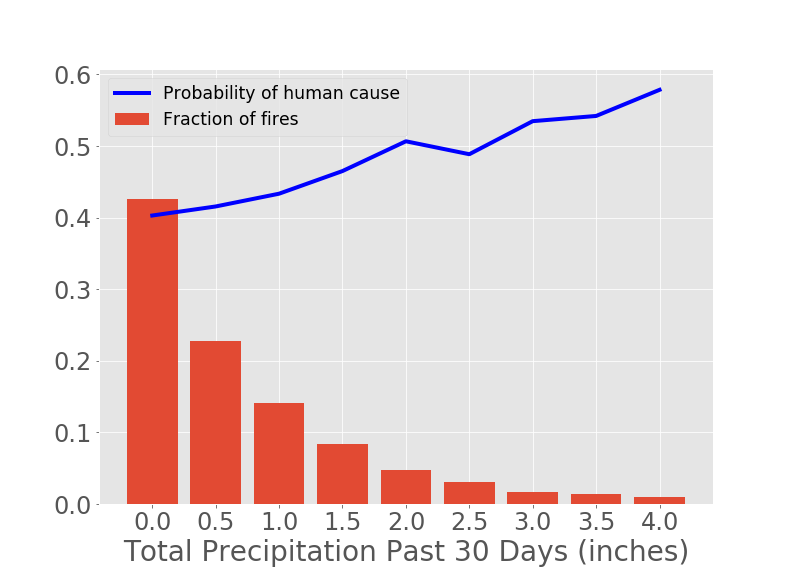
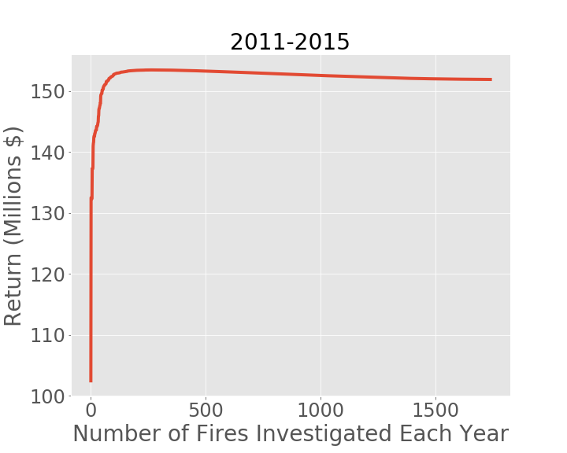
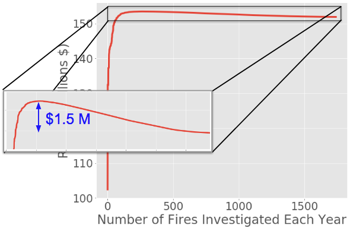

# Using Machine Learning to Optimize Wildifre Investigations 

The objective of this project is to create a tool to optimize the process of wildfire investigations.  
An example of this tool deployed as a web app can be seen [here](http://fireinvestigator.online).

### Business Understanding
 
Washington’s Department of Natural Resources is required by law to recover the suppression costs of wildfires in state or protected lands, whenever the fire was criminally or negligently caused.  A cause investigation is carried out for every fire, but only those caused by human activity will yield a return for the state.  With more than 1000 wildfires occurring all across Washington every year, identifying the fires that are most likely to be human-caused could enable prioritization and more efficient use of department resources.

|  | 
|:--:| 
| *Location of Washington wildifires in 2014* |

### Data Understanding

#### Data Sources

* Spatial Wildfire Occurrence Data for the United State 1992-2015, published by [USDA Forest Service](https://www.fs.usda.gov/rds/archive/Product/RDS-2013-0009.4/).  Contains latitude, longitude, date, cause and size of wildfires across the US.  
* Weather data from [NOAA](https://www.ncdc.noaa.gov/cdo-web/datasets), including daily precipitation and minimum and maximum temperatures from 1000 weather stations in Washington. 
* Population density data from [United States Census Bureau](https://catalog.data.gov/dataset/tiger-line-shapefile-2010-2010-state-washington-2010-census-block-state-based-shapefile-with-ho) 

#### Feature Engineering

Data from different sources were combined to engineer features that, given a fire, are predictive of the probability that it was caused by human activity.  Specifically, the latitude and longitude of each fire is used to obtain the population density at that location.  Additionaly, data from the nearest weather station is used to create aggregate weather features.

|  | 
|:--:| 

As an example, consider the total precipitation during the 30 days prior to the start of a fire (see below).  As expected, most fires take place during very dry months.  However, given that there is a fire, the conditional probability that it was casued by human activity actually increases as the amount of precipitation goes up.

|  | 
|:--:| 
| *Fraction of fires and probability of human cause as a function of the total precipitation during the 30 days prior to the start of the fire.* |

### Modeling

A gradient boosted soft classifier was trained to predict the probability that the cause of a fire is due to human activity. This predicted probability is then used to calculate the expected return for the state, taking into account the size of the fire and the cost of the investigation.  

|  | 
|:--:| 
| *Schematic of model flow and deployment* |

The currently open cases, prioritized according the model predictions, can be displayed in a dahsboard for investigators. An example of this tool using 2015 test data is deployed [here](http://fireinvestigator.online/index.html).

### Evaluation

The performance of the model was evaluated using test data for the years 2011-2015.  The figure below shows the total return for the state during this five year period as a function of the numbers of fires investigated each year and prioritized according to the model.

|  | 
|:--:| 
| *Total return vs. number of fires investigated each year* |

The total return increases rapidly, meaning that the model does a good job of identifying which fires should be investigated first.  The maximum is at 287 fires, continuing to investigate beyond this point would not be profitable.  In fact, zooming into the top region of the graph (see below) reveals that investigating only the top ranked 287 fires can save the state $1.5 million compared to the current approach of investigating all fires.

|  | 
|:--:| 
| *Total return is maximized by investigatin the 287 top priority fires each year* |

### Sources
https://www.dnr.wa.gov/Investigations  
https://www.ncdc.noaa.gov/cdo-web/search   
https://www.fs.usda.gov/rds/archive/Product/RDS-2013-0009.4/

